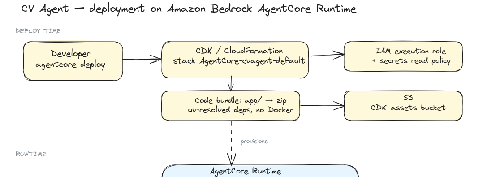
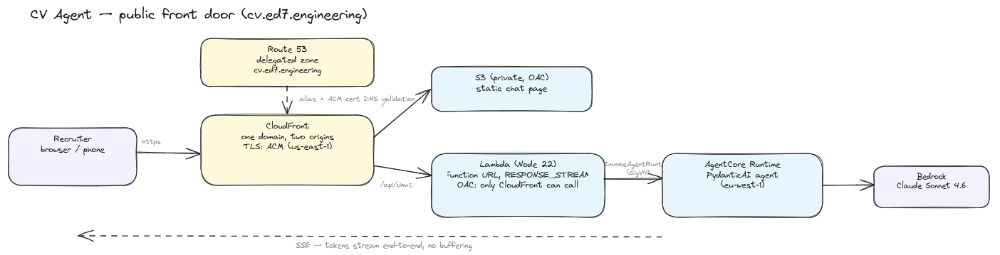

# CV Agent

An AI assistant for my personal brand, live at **[cv.ed7.engineering](https://cv.ed7.engineering)**.

Recruiters chat with it in real time: it answers from my CV, hands out a
short-lived presigned link to the PDF on request, and pushes a notification to
my phone the moment someone leaves contact details. Everything streams
token-by-token, end to end.

Under the hood — built entirely on **Amazon Bedrock AgentCore**:

- **PydanticAI** agent on **AgentCore Runtime** (CodeZip build — no Docker),
  Claude Sonnet 4.6 via Bedrock with prompt caching
- Per-session isolated microVMs give conversation memory for free
- CV and credentials live in **Secrets Manager** — nothing personal in this
  repo or in the deployment bundle
- **CloudFront + S3 + Lambda** (`RESPONSE_STREAM`) public front door on a
  Route 53-delegated subdomain
- OpenTelemetry traces and logs in CloudWatch

## Setup

```sh
cd app && uv sync
```

Configuration (model id, secret names) lives in `app/src/cv_agent/settings.py`
and can be overridden via `CV_AGENT_*` env vars. Personal data (the CV) and the
Pushover keys live in AWS Secrets Manager — nothing sensitive in the repo or
in the deployment bundle.

AWS credentials must resolve via the usual boto3 chain with `bedrock:InvokeModel*`
permission on the Claude Sonnet 4.6 inference profile.

**The CV** is read from the `cv-agent/cv` secret (fallback: `app/src/cv_agent/data/cv.md`,
gitignored — see `cv.example.md` for the structure). To update it:

```sh
aws secretsmanager put-secret-value --secret-id cv-agent/cv --secret-string file://your-cv.md
```

## Run

Web chat (streaming):

```sh
cd app && uv run python -m cv_agent.web.app
# open http://127.0.0.1:8000
```

Terminal chat:

```sh
cd app && uv run cv-agent-chat
```

## Deploy to AgentCore Runtime



The agent is deployed with the [AgentCore CLI](https://www.npmjs.com/package/@aws/agentcore)
(`npm install -g @aws/agentcore`). One command does everything:

```sh
agentcore deploy --yes   # or run scripts/deploy.sh for the full commented flow
```

What happens under the hood:

1. **CodeZip build — no Docker.** The CLI resolves dependencies from
   `app/pyproject.toml`/`uv.lock` with uv and bundles them with the code into
   a single zip (only `app/` is bundled, so nothing personal or IDE-related
   ever ends up in the artifact).
2. **CDK → CloudFormation.** The zip is uploaded as a CDK asset to S3, and the
   stack (`agentcore/cdk/`) provisions the AgentCore Runtime (managed
   Python 3.13), its IAM execution role, and OpenTelemetry wiring.
3. **Secrets at runtime.** The CV and the Pushover credentials are read from
   Secrets Manager at first invocation — `scripts/deploy.sh` attaches the
   least-privilege read policy to the generated execution role.
4. **Sessions.** Each conversation gets its own isolated microVM
   (`runtimeSessionId`), which keeps per-session state alive between turns.

Useful afterwards:

```sh
agentcore invoke "Hello" --stream   # ad-hoc invocation
agentcore logs                      # runtime logs from CloudWatch
agentcore status                    # ARN, endpoint, state
```

## Public front door



Recruiters chat at **https://cv.ed7.engineering**. The stack lives in `infra/`
(CDK, TypeScript) and deploys to `us-east-1` (CloudFront requires ACM
certificates there):

```sh
cd infra
npx cdk bootstrap aws://<account>/us-east-1   # one-time
npx cdk deploy
```

Design notes:

- **One domain, two origins.** CloudFront serves the static chat page from a
  private S3 bucket (`/`) and proxies `/api/chat` to a Lambda Function URL.
  Both origins use Origin Access Control — neither is reachable directly.
- **Streaming all the way.** The Lambda (Node 22) runs in `RESPONSE_STREAM`
  mode and pipes the runtime's SSE bytes straight through, so tokens render in
  the browser as the model produces them. This is also why there is no API
  Gateway in the picture: it buffers responses and would kill the streaming UX.
- **DNS.** `cv.ed7.engineering` is a subdomain delegated to Route 53, which
  lets CDK validate the ACM certificate and manage records automatically.
- **Cost control.** The endpoint is public and every message spends Bedrock
  tokens: the Lambda has a small reserved concurrency, message length is
  capped, and session ids are validated before reaching the runtime.

## Layout

```
app/                # the deployable agent (this is what gets bundled)
  main.py           # AgentCore Runtime entrypoint
  src/cv_agent/
    agent.py        # PydanticAI agent + record_recruiter_contact tool
    runtime.py      # AgentCore runtime wrapper (BedrockAgentCoreApp)
    pushover.py     # Pushover notification helper
    settings.py     # config (CV_AGENT_* env vars, Secrets Manager names)
    web/            # local dev harness: FastAPI SSE chat + static UI
    cli.py          # terminal chat
agentcore/          # AgentCore project config + CDK app (deploy infra)
scripts/deploy.sh   # commented deploy walkthrough
```
